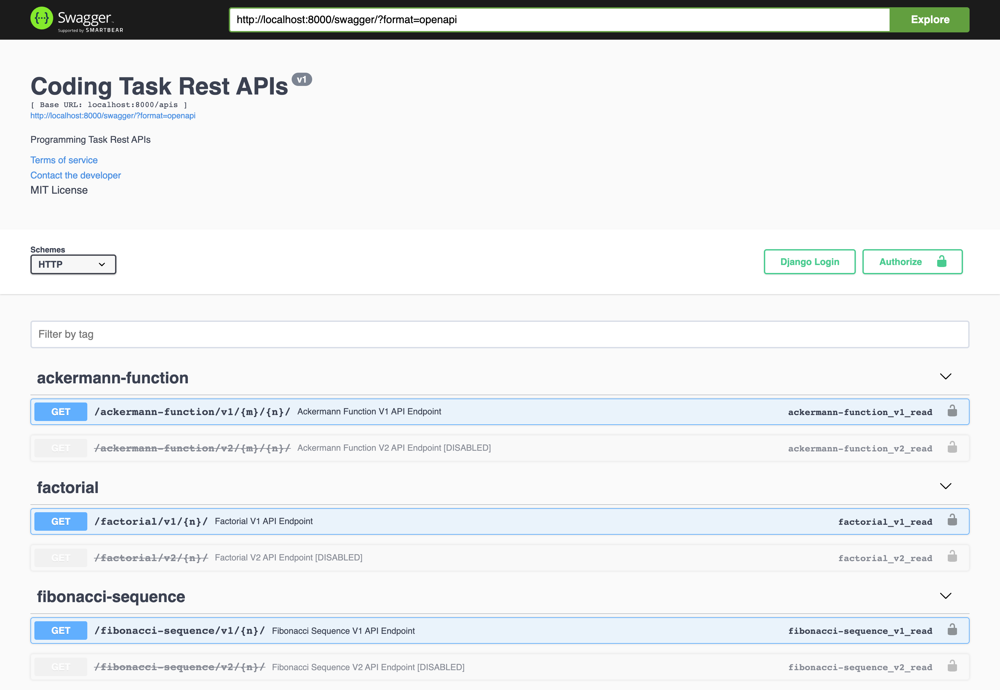

APIs Details
============

Swagger
----------------------------------------------------------------------

The API's documentation using swagger can be found at: `Swagger docs <http://localhost:8000/swagger/>`_

* And version 2 of any API will be marked as disabled -deprecated- to move the users to version 1.

Redoc
----------------------------------------------------------------------

Also you can check the other redoc theme at: `Redoc docs <http://localhost:8000/redoc/>`_

    .. image:: images/redoc.png

Ackermann Function Samples
----------------------------------------------------------------------

* Version 1

    .. image:: images/ackermann_1.png

* Version 2

    .. image:: images/ackermann_2.png

Factorial Samples
----------------------------------------------------------------------

* Version 1

    .. image:: images/factorial_1.png

* Version 2

    .. image:: images/factorial_2.png

Fibonacci Sequence Samples
----------------------------------------------------------------------

* Version 1

    .. image:: images/fibonacci_1.png

* Version 2

    .. image:: images/fibonacci_2.png
